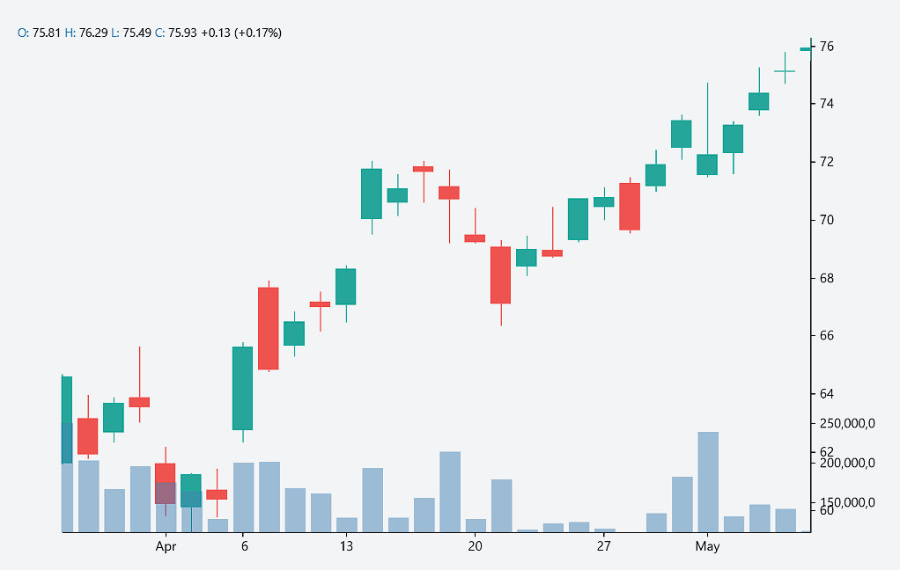

# Interactive Visualization of Stock Market and Analysis

📈 A full-stack MERN application designed for interactive stock market visualization and analysis. Users can dynamically select stock symbols and visualize historical price movements and volume data using elegant candlestick charts powered by D3 and `react-financial-charts`.

---

## 🧰 Tech Stack

### Frontend
- **React.js**
- **Tailwind CSS**
- **D3 & react-financial-charts** for rendering candlestick charts

### Backend
- **Node.js**
- **Express**
- **Axios** for API requests

### Database
- (Optional) MongoDB *(if you plan to persist data)*

---

## 🚀 Features

- Dropdown menu to select and switch between stock symbols
- Real-time fetching of historical stock data from a backend API
- Interactive candlestick charts with mouse tracking, tooltips, and zoom
- Volume bar charts rendered below price charts
- Responsive layout with dynamic resizing

---

## 📂 Project Structure


---

## 🚀 Getting Started

Follow these steps to run the project locally.

### 1. Clone the repository

```bash
git clone https://github.com/your-username/stock-visualization-app.git
cd stock-visualization-app

---

## 🔧 Backend Setup

1. Navigate to the backend directory:

    ```bash
    cd backend
    ```

2. Install dependencies:

    ```bash
    npm install
    ```

3. Create a `.env` file in the backend folder:

    ```env
    PORT=5000
    # Optional: If using MongoDB
    # MONGO_URI=your_mongodb_connection_string
    ```

4. Start the backend server:

    ```bash
    npm run dev
    ```

The server will run at [http://localhost:5000](http://localhost:5000).

---

## 🎨 Frontend Setup

1. Navigate to the frontend directory:

    ```bash
    cd frontend
    ```

2. Install dependencies:

    ```bash
    npm install
    ```

3. Start the development server:

    ```bash
    npm start
    ```

The frontend will run at [http://localhost:3000](http://localhost:3000).

---

## 🔌 API Endpoints

| Method | Endpoint             | Description                                   |
|--------|----------------------|-----------------------------------------------|
| GET    | `/api/stocks`        | Returns a list of available stock symbols     |
| GET    | `/api/stock/:symbol` | Returns OHLC and volume data for the symbol   |

---

## 📸 Screenshots

> *(Insert your own screenshots or GIFs here)*

### Dashboard with Dropdown and Chart


### Candlestick and Volume Chart



---

## ⚠️ Known Issues

- Make sure the backend server is running before starting the frontend.
- The current setup fetches stock data from a local API. You may need to integrate external data providers (e.g., Alpha Vantage, Yahoo Finance) for production.
- No authentication or user management is included yet.

---

## 📝 License

This project is licensed under the MIT License.

---

## 🙌 Acknowledgements

- React Financial Charts  
- D3.js  
- Tailwind CSS  
- React  
- Express.js  
- Axios

---

## 📬 Contact

For questions, suggestions, or collaboration:

- GitHub: [@your-username](https://github.com/your-username)  
- Email: yourname@example.com

---
